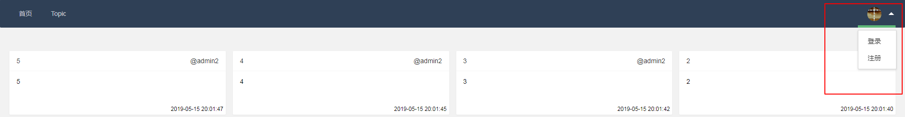

[TOC]

# 运行

## 环境

**node v7.6.0** 或 ES2015及更高版本和 async 方法支持.

## 运行

```bash
npm install
node app.js
```


# 页面路由

| URL                     | 页面         |
| ----------------------- | ------------ |
| /                       | 首页         |
| /login                  | 登录         |
| /signup                 | 注册         |
| /topic#page=publish-tab | 主题发布页面 |
| /topic#page=mange-tab   | 主题管理页面 |

# 接口

| URL           | Method | 描述             |
| ------------- | ------ | ---------------- |
| /signup       | post   | 用户注册         |
| /sessionlogin | post   | 用户session登录  |
| /testlogin    | get    | 测试用户登录     |
| /logout       | get    | 用户退出         |
| /addtopic     | put    | 添加留言主题     |
| /deletetopic  | delete | 删除留言主题     |
| /modifytopic  | post   | 修改留言主题     |
| /gettopic     | get    | 获取指定ID的留言 |
| /gettopics    | get    | 获取所有留言     |


# DEMO

## INDEX首页


## 导航栏




## TOPIC 留言


## 留言主题管理


## 登录


## 注册


